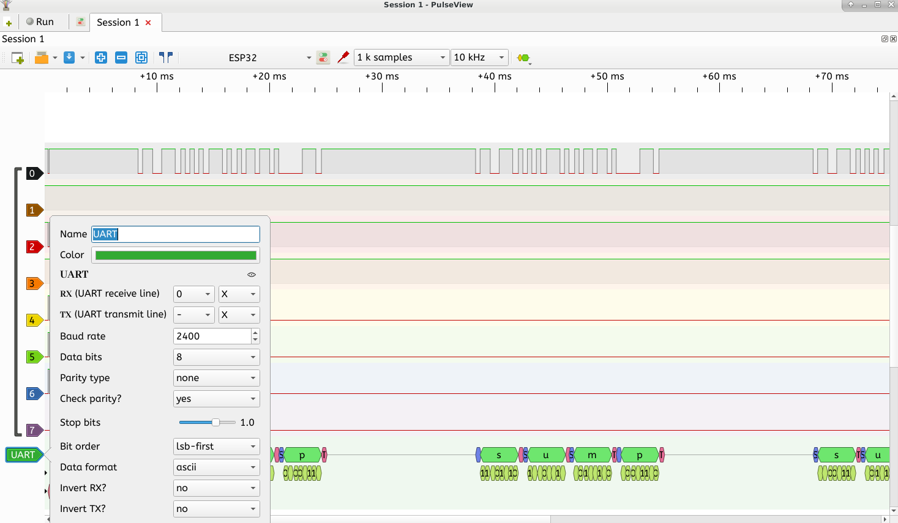
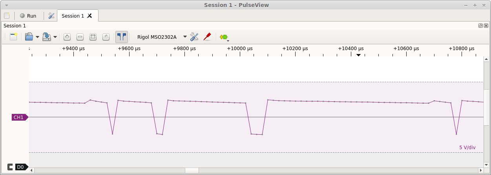
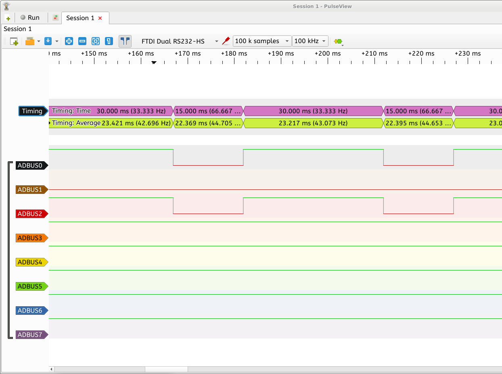
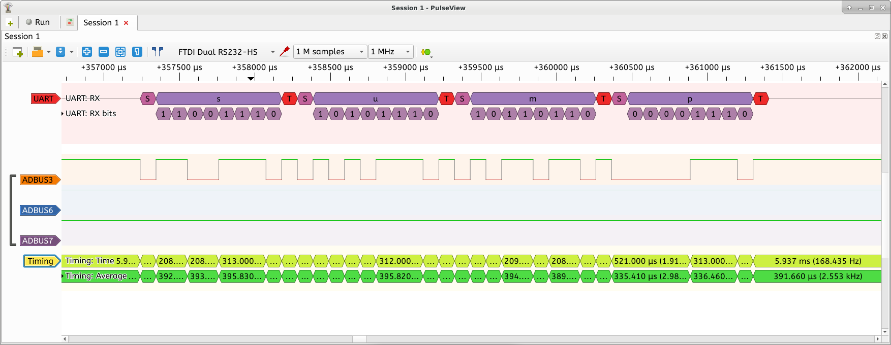

# Sigrok esp 32 

A SUMP compatible logic analyser for the esp32, for use with i.e sigrok
https://en.wikipedia.org/wiki/Sigrok

For digital input, an Open bench logic sniffer is emulated. (ols)
A Rigol DS scope (rigol-ds) is emulated in order to allow sampling of analouge input.
Use pulseview to get the graphical input.

# Quickstart

The different options as described below are defined in the file app-config.h
The default configuration is to use rigol-ds over ethernet port 5555
Go to the configuration options and set ssid and password
    make menuconfig 
    Wifi and TFT Configuration  --->

Also set
```
  Bootloader log verbosity (No output)  --->    
  Compiler options ->  Optimization Level (Release (-Os)) 

  → Component config → ESP32-specific -> CPU Frequency (160 Mhz)
  If you change frequency, you have to set timings differently in
  void setTimescale(float scale) 
  Currently timing is calculated by counting cycles.
  Analuge data is temporary disabled.


```
The for the Rigol, only 1400 samples is available.

Pin 17 is default connected (9600 Baud UART output)
Then start pulseview 
Replace 127.0.0.1 with your  
    pulseview -d rigol-ds:conn=tcp-raw/127.0.0.1/5555 -l 5

Do not use timebase less than 1 ms as timing will not be accurate.

# Input pins
```
Pin 13-20 should be setup as input 
Pin 17 will be setup with uart test pulse
Pin 15 uses the remote device to setd a test pulse
```
Only datasource live works.

# Analogue
```
PIN 36 is used for CH1 
Sampling is not properly calibrated, and code needs some care.
```


# DMA sampling

Note, the only way to make this project usable, would to use DMA with a steady campling rate.
I try to use this in sampler.c, but was not successful 
If you would like to try, do change to
    #if 1 in sampler.c and
    #if 0 in analog.c
The pixel clock is defined in app-config .h
    PIXEL_LEDC_PIN 22
Here I use Pin 27 for debugging (ledPin)
This would have allowed data source from memory.


# Sump
You have to change configuration in app-config.h to get this to work
    #define SUMP_OVER_UART 1
You will also have to go through the code.

You might have to press scan a few times until the ESP32 appears.
Set samplingrate to 10 KHZ 


When using the WROVER board (USB0 is for JTAG) do,
sigrok-cli -d ols:conn=/dev/ttyUSB1 -l 5 --scan
Otherwise when scanning sump
sigrok-cli -d ols:conn=/dev/ttyUSB0 -l 5 --scan



# Analogue
```
(ADC1_CHANNEL_0)      //GPIO 36
```



Still lots of tuning to do here.

# Pins
Pins that can be used for logical input on the WROVER board.

```
            12,
            13,
            14,
            15,
```

Pins defined  for logical input with the code in this repository over SUMP.

```
            12,
            13,
            14,
            15,
```

Pins defined  for logical input with the code in this repository rigol-ds.

```
            13,
            14, // Remote device
            15,
            16,
            17,
            18,  
            19,  // UART RX
            20,   // Missing???
            21,
            22,
            23,
            24,
            25,
            26,
            27,
            28,
            29
```


Testdata in this example. To get testdata connect i.e pin 17 & 22 and pin 23 & 18
```
            17, remote device, square pulse
            18, 9600 Baud UART with repeated text, "sump UUU"
```


If using the WROVER-kit, you can use the JTAG chip to do data aquisition.
To get better debuginfo, start pulseview with logging,  -l 5 
On the WROVER dev kit, it seems that the FTDI-LA drivers are used.

https://sigrok.org/gitweb/?p=libsigrok.git;a=tree;f=src/hardware/ftdi-la
This allows sampling without a second ESP32 up to 10Mhz.

In the code the sump protocol is implemented over serial and tcp/ip. 

I found that the terminal program cutecom allowed sending single HEX bytes, this is useful for debugging the implementation of the SUMP protocol.

# Pin mapping

In sigrok the following WROVER-KIT pins are mapped like this.
```
PIN13 = ADBUS0
PIN12 = ADBUS1
PIN15 = ADBUS2
PIN14 = ADBUS3
```

THE Jtag interface uses the following pins.
```
1 	CHIP_PU 	TRST_N
2 	MTDO / GPIO15 	TDO
3 	MTDI / GPIO12 	TDI
4 	MTCK / GPIO13 	TCK
5 	MTMS / GPIO14 	TMS
```

# Wrover debug pins
The following red/green/blue led is available on the WROVER kit.
```
  RED    gpio_set_direction(GPIO_NUM_0, GPIO_MODE_OUTPUT);
  GREEN  gpio_set_direction(GPIO_NUM_2, GPIO_MODE_OUTPUT);
  BLUE   gpio_set_direction(GPIO_NUM_4, GPIO_MODE_OUTPUT);
	gpio_set_level(GPIO_NUM_0, 0);
```

After making sure you use the correct Component config → 
ESP32-specific -> Main XTAL frequency
Another good idea, might be to set these values.
```
  Bootloader log verbosity (No output)  --->    
  Compiler options ->  Optimization Level (Release (-Os)) 
```
Otherwise they will interfer with the SUMP protocol.

To get some test data, connect  a 500/250 microS pulse is generated with the remote device on pin 14 (D2)
```
app_main() {
    ...
    send_remote_pulses();
    rmt_write_items(config.channel, items, 1, 0);
}
```
When starting the sigrok gui, pulseview, the device was identified and this is how the timing analysis looks like.


[https://raw.githubusercontent.com/Ebiroll/esp32_sigrok/master/sigrok.png ]

# Analysis of UART 2400 Baud
To get some more testdata the uart sends the text "sump" on pin 18
```
static void uartWRITETask(void *inpar) {
  uart_port_t uart_num = UART_NUM_1;    
  echoLine[0]='s';
  echoLine[1]='u';
  echoLine[2]='m';
  echoLine[3]='p';

  while(true) {
    int size = uart_write_bytes(uart_num, (const char *)echoLine, 4);
    vTaskDelay(10 / portTICK_PERIOD_MS);
  }
}
```


# Project status
Now it is working with sigrok and the latest version of esp-idf.

Perhaps this bugfix was helpful, but initially the SUMP protocol was not working
https://github.com/espressif/esp-idf/commit/f482e9e54ce83e249e46f5ee082f6ffb61431339


If you test repeatedly with 
```
sigrok-cli -d ols:conn=/dev/ttyUSB1 -l 5 --scan
sigrok-cli -d rigol-ds:conn=tcp-raw/192.168.1.130/5555  -l 5 --scan
```
With my version of sigrok and esp-idf rigol-ds will  work 9/10 times. 

To get more stable performance try removing the driver you dont plan to use in app_main()

For analog data with rigol driver
```
    //init_uart();

    scpi_server_init(&xHandlingTask);
    //sump_init();
    //sump_server_init();
    //sump_uart();
```

For digital data with ols (sump) driver
```
    init_uart();

    //scpi_server_init(&xHandlingTask);
    sump_init();
    //sump_server_init();
    sump_uart();
```
  sump_server_init(); is used for SUMP data on port 5566 and debugging
  Normal rigol-data is handled on port 5555 


Further development of ESP32 as a scope will be carried out here,
https://github.com/Ebiroll/qemu_esp32/tree/master/examples/38_wifiscope


# Sigrok
In pulseview
```
Chose driver, Open bench Logic sniffer (ols)
Choose the interface, i.e./dev/ttyUSB0
Press Scan for devices,
If successful select ESP32 with 8 channels.
Change samplerate 10kHz. Its currently hardcoded to sample at this rate.
```
   I did some experimental aquisition with parallell i2s aquisition in espScope.c
	 The idea was to to route out the audio PLL signal and use as PCLK input
   Also the HSYNC and VSYNC siglnals must be HIGH for DMA sampling to work
   However, I never got this to work. Probably some other clock signal is missing.


Also you can add more input pins by adding them in,
uint16_t getSample() &  portc_init(void)

For analog data try the rigol-ds over wifi on port 5555.

# QEMU 
SCPI on network, works well in QEMU, but over wifi with esp-idf lwip netconn is broken. 
The old file scpi_server.c is kept but the new file is called scpi_socl_server.c
Add #define RUN_IN_QEMU 1 in app-config.h

    xtensa-softmmu/qemu-system-xtensa -d guest_errors,unimp  -cpu esp32 -M esp32 -m 4M -net nic,model=vlan0 -net user,id=simnet,ipver4=on,net=192.168.4.0/24,host=192.168.4.40,hostfwd=tcp::5555-192.168.4.3:5555  -net dump,file=/tmp/vm0.pcap  -s    > io.txt

And client can be run as,

    ./olas-cli -d rigol-ds:conn=tcp-raw/127.0.0.1/5555  -l 5    --show
    pulseview -d rigol-ds:conn=tcp-raw/127.0.0.1/5555 -l 5

# OTA updates,

If you enable Partition Table (Factory app, two OTA definitions)  
You can update the application with, change according to your IP

    curl 192.168.1.111:8032 --data-binary @- < build/sigrok.bin


# Command line run
When developing, this is useful and repeatable

```
sigrok-cli -d ols:conn=/dev/ttyUSB0 -l 5  -c samplerate=10Khz --samples 100
sigrok-cli -d ols:conn=/dev/ttyUSB0 -l 5 --scan
sigrok-cli -d ols:conn=/dev/ttyUSB1 -l 5 --show
```

SCPI over the network also works now.

    sigrok-cli -d rigol-ds:conn=tcp-raw/127.0.0.1/5555  -l 5 --scan

It is possible tp run sump over network or USB, however ols driver only supports SUMP over serial.
To use SUMP over network you must find some other program.
I tried the PIPISTRELLO p-ols driver. This is however his did not work.


To debug this use printf for debugging
```
void sump_debug(char *str,unsigned int value) {
    printf("%s 0x%X\n",str,value);   
}
```
Remove call to init_uart
//init_uart();
screen /dev/ttyUSB1 115200
sigrok-cli -d p-ols:conn=tcp-raw/192.168.1.130/5566  -l 5 --scan


To debug SUMP over serial, then use  TCP/IP for debugging.
```
To use debug output, remove #if 0 in:
sump_debug()

```

nc 192.168.1.130 5566
This port is also used for the SUMP protocol over TCP/IP
If you use the Pipistrello OLS (p-ols) then you can use this
sigrok-cli -d p-ols:conn=tcp-raw/192.168.1.130/5566  -l 5 --scan
I never got SUMP over TCP/IP to work.


For data aquisition High resolution timer is used.
http://esp-idf.readthedocs.io/en/latest/api-reference/system/esp_timer.html


Trying to  add rigol emulation and emulate sending of analouge and digital waveforms

In directory linux, you can build a test client, it also listens to port 5555
./test

To try connect 
 sigrok-cli -d rigol-ds:conn=tcp-raw/127.0.0.1/5555  -l 5 --scan
This will send *IDN? to the instrument

You can also try this 
./sigrock-cli -d rigol-ds:conn=tcp-raw/192.168.1.130/5555  -l 5  --show


https://assets.tequipment.net/assets/1/26/Documents/Rigol/vs5000_programming.pdf

# Building sigrok

```
To build a debuggable version of sigrok-cli use the CMakeLists.txt file
 mkdir sigrok;cd sigrok;
 git clone git clone git://sigrok.org/libsigrok.git 
 // Not this?? git://sigrok.org/libsigrokcxx.git
 git clone git://sigrok.org/sigrok-cli
 cp ../sigrok_build/CMakeLists.txt 
 cd libsigrok
 ./autogen.sh
 ./configure  --without-libbluez
 Patch sigrok-cli/show.c to i.e. printf("sigrok-cli %s\n\n", "0.X");
 cd ..
 mkdir build;cd build; cmake ..
 ./olas-cli -d rigol-ds:conn=tcp-raw/192.168.1.127/5555  -l 5  --show
 ./olas-cli -d ols:conn=/dev/ttyUSB0 -l 5 --scan
```

To test reading data with sump.
./sigrok-cli -d ols:conn=/dev/ttyUSB0 -l 5  -c samplerate=10Khz --samples 100


# Some other SUMP implementations,

https://github.com/hydrabus/hydrafw/wiki/HydraFW-SUMP-guide

https://github.com/jpbarraca/LogicAlNucleo/blob/master/src/main.cpp

https://github.com/tuxyme/metal-pi/blob/master/analyzer/main.c


https://github.com/gillham/logic_analyzer/blob/master/logic_analyzer.ino

# Rigol and SCPI

QT rigol scope
https://gitlab.com/Teuniz/DSRemote

https://github.com/hackrid/pyrigolla/


Other than the SUMP protocol we could try to emulate this RIGOL osciloscope,
https://www.batronix.com/shop/oscilloscopes/Rigol-VS5202D.html


https://assets.tequipment.net/assets/1/26/Documents/Rigol/vs5000_programming.pdf


Data format,

https://rigol.desk.com/customer/en/portal/articles/2269119-how-do-i-format-the-data-returned-from-a-ds1000e-d-series-scope-

https://en.wikipedia.org/wiki/Standard_Commands_for_Programmable_Instruments

https://github.com/cjameshuff/rigolutils

http://literature.cdn.keysight.com/litweb/pdf/81180-91020.pdf

https://grenville.wordpress.com/2015/01/04/a-clone-of-the-saleae-logic-8-channel-analyser/

